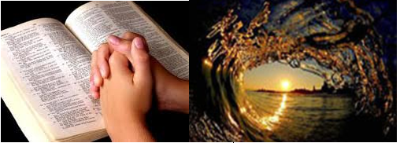

# MEDITE!

**Data de Publicação:** 19/11/2013  
**Autor:** João de Brito Freires  
**Link Original:** [https://jbfreires.blogspot.com/2013/11/medite.html](https://jbfreires.blogspot.com/2013/11/medite.html)  

---

Vou subindo até uma determinada altura, quando estou
quase chegando à luz se apaga. Desço à profundidade do abismo até um
determinado ponto e a luz volta a acender. O que faço neste momento? Reflito, paro
e penso. Então volto ao ponto de partida, ponto original. Eis aí a solução! Jesus
disse, não quero que sejas como criança,
mas que haja com a pureza de uma criança.

Autor: João de Brito Freires.

---