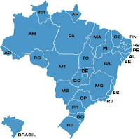

# O Brasil que Eu Não Quero e o Brasil que Eu Quero

**Data de Publicação:** 01/04/2018  
**Autor:** João de Brito Freires  
**Link Original:** [https://jbfreires.blogspot.com/2018/04/o-brasilque-e-u-nao-quero.html](https://jbfreires.blogspot.com/2018/04/o-brasilque-e-u-nao-quero.html)  

---

O BRASIL
QUE 

           E U

    NÃO QUERO.  

             E

    O BRASIL QUE 

           E U

       QUERO

A
nossa cultura hoje. É necessário combater o combate com o bom combate, a
violência com violência. Queremos um Brasil pró o amanhã. SUGERIMOS CRIAR UMA MATÉRIA COM CURRÍCULO ESCOLAR, ESPECÍFICO E OBRIGATÓRIA
PARA TODOS OS NÍVEIS DE ENSINO. Ensinando-os e preparando as nossas
crianças, jovens, adultos, mostrando que a violência não resolve, só gera desconforto,
mais violência e dor. Desde que implantado, será um trabalho com resultado para
uma nova geração, assim sendo cremos que daqui mais ou menos 20 anos, não
teremos mais Corrupção, Assassinatos, Estupro, Desonestidade, Violência em geral.

A Corrupção é falta de vergonha, caráter,
de punição, (impunidade).

A violência é falta de Cultura, Preparo Amor,
Civilidade.

(Hoje
parece que o Crime compensa). È um engano, quantas vidas sem Paz, estão se ceifando.
(Abatidas), (Vamos aguardar o resultado do momento. No
momento é o que precisa, mas não é isto que o Brasil, nós Brasileiros queremos.
Rogamos as Autoridades Responsáveis. Vamos preparar o Brasil para o amanhã e para
os nossos Filhos). 

Srs.
(As) Autoridades constituídas e Candidatos, VAMOS ASSUMIR ESTA BANDEIRA, EMPUNHAR A BANDEIRA DA VIDA...

Rogo
para que os nossos Dirigentes permitam que, DEUS ilumine as vossas mentes,
vossos corações, para fazer somente o bem, e serem mais honestos, não falar,
fazer tantas besteiras, e sim algo que importam, não só no o momento, más para
o amanhã. Não importam se o bem que fazemos no momento, iremos desfrutar ou não.
Na minha concepção é o maior bem que irás fazer, não só para seus filhos e
Netos (A humanidade),  Ao nosso DEUS e a
você nossos agradecimentos.

---