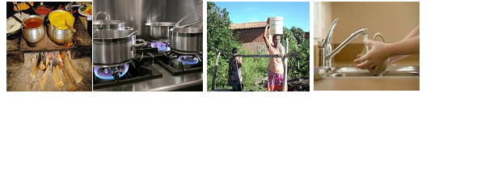

# Antigamente 02: Retrospectiva da Época ao Momento

**Data de Publicação:** 31/01/2017  
**Autor:** João de Brito Freires  
**Link Original:** [https://jbfreires.blogspot.com/2017/01/antigamente_31.html](https://jbfreires.blogspot.com/2017/01/antigamente_31.html)  

---

ANTIGAMENTE. 02

  
 
 
  
  
  
  
  
  
  
  
  
  
  
  
 
 
 

 

 
 
 
 
 
   

                                  

RETROSPECTIVA, DA
ÉPOCA, AO MOMENTO.

Cozinhar era a maior
dificuldade para as donas de casas, o fogão era a lenha, as vezes a lenha
estava verde ou molhada. Hoje o fogão é elétrico
e o gás é encanado, basta apertar um pequeno botão

Água, era buscada nos poços, nos
córregos, nas famosas latas d`agua na
cabeça. Hoje basta abrir a torneira. 

Banho, nos córregos, nas
bacias, ou em chuveiros improvisados. Hoje abre-se
o registro, logo a agua quente derrama sobre si.

Casas, eram feitas de pau a
pique, as mais sofisticadas, eram rebocadas com barro extraídos direto do solo,
ou em forma de adobe, a cobertura para proteger do Sol e Chuva, eram com folhas
de bacuris, ou semelhantes. Hoje as mais
sofisticadas construções. 

Tratamento dentário, era tão
difícil e caro, quando um dente doía, o dentista o arrancava, com isso a pessoa
ia perdendo seus dentes e ficando banguelas, ou passando a usar dentaduras. Hoje, além do cloro que protege contra as cáries o tratamento
dentário é feito com facilidade, tanto na área pública, quanto na área privada,
além dos implantes. 

Estradas, quase não existiam, asfalto
nem pensar, percurso onde gastava dois dias. Hoje se
faz com duas horas. 

A palavra do homem valia tanto
quanto documento. Hoje para o homem sem caráter,
nem documento tem valor. 

As viúvas, e as mães solteiras,
eram discriminadas pela sociedade, as outras mulheres não se aproximavam, não
se misturavam. Hoje não existe esta
discriminação. 

O matrimônio, casamento eram para
eternidade. Hoje, já com este pensamento,
casa-se e descasa-se. 

Os filhos, tinham muito
respeito, ouvia e tomavam bênção dos pais. Hoje
nem cumprimenta, ou a conversa é mais para exigir mesada. 

As crianças, trabalhavam,
brincavam, sem nenhum medo dos malfeitores. Hoje a Lei não
permite que trabalham, estão sujeitos aos maus feitores, com isto sobra tempo
para a prática de tantos atos maléficos. 

Namorar, só de olho a
distância. Hoje quase sempre, rola tudo no
primeiro encontro. 

Brinquedos, as próprias
crianças, se encarregavam de fazer. Hoje tudo
eletrônicos e sofisticados. 

Festas e danças, juntamente
com as poeiras, duravam a noite inteira. Hoje, os
sofisticados clubes e boates. 

Festas de casamentos, eram
regados de muitas comidas, latas e latas e doces de todas suas espécies e
sabores. Hoje coquetéis servidos por garçons. 

Os homens, eram cavalheiros
com as damas. Hoje são cavaleiros. 

O povo, acreditava na justiça,
nas autoridades. Hoje a desconfiança é total. 

O político, o homem público tinha
credibilidade. Hoje a corrupção está
desenfreada.

---