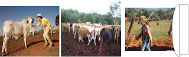

# Estória da Vovo

**Data de Publicação:** 25/12/2016  
**Autor:** João de Brito Freires  
**Link Original:** [https://jbfreires.blogspot.com/2016/12/estoria-da-vovo.html](https://jbfreires.blogspot.com/2016/12/estoria-da-vovo.html)  

---

No
campo, todos trabalham muito.  Acostumados a lidar no campo, uma mulher saiu
para apartar o gado, quando coincidentemente encontrou com a comadre, na divisa
das fazendas. Depois de muita conversa, matar a saudade com longas estórias, se
despedem. Ao retornarem, uma delas foi contar aos demais como foi o trabalho e
o reencontro das duas.

Quando me deparei com a CUMADE, bem na cancela da divisa. 

EU DE CÁ. A
CUMADE DE LÁ. 

EU CÁ MINHA.
A CUMADE CADELA.

TOPEI DANO,
EU DE CÁ. A CUMADE DE LÁ.

EU CA MINHA,
A CUMADE CADELA,

CÁ VARA DE
TOCA GADO NA MÃO.

E COM A
MESMA DISPOSIÇÃO DE SEMPRE.

NÃO PARAVA DE
DÁ. 

EU DAVA DE
CÁ, E A CUMADE DAVA DE LÁ. 

MEMO ASSIM
DAMO PARA CUNVERSÁ.

COMO SEMPRE,
CONDUZIMO O GADO PRÓ CURRÁ.

QUARQUER DIA
DE NOVO CUMADE, NOIS VAMO INCONTRÁ.

Antigamente nas fazendas, muitas das
pessoas ainda usavam aquele vocabulário, bem regional. Resumia toda a sua fala,
pareciam que não tinham tempo ou tinha preguiça de falar. Para os demais, não
foram muito difícil compreender, o que a comadre estava falando.

Falando com muito entusiasmo do
momento, da alegria ao apartar o gado, quando encontrou com a comadre, vizinha
da fazenda, a qual há muito tempo não havia e que no momento estava fazendo
também o mesmo que ela, apartando o gado. 

Ambas estavam com uma vara na mão. (EU CÁ MINHA. A CUMADE CADELA), Vara
apropriada para conduzir o gado. Geralmente esta é uma pequena vara com um
ferrão em sua ponta, que serve para intimidar e conduzir o gado ao destino
desejado.

Quando encontraram, coincidentemente
estavam batendo, (TOPEI DANDO, EU DE CÁ
E A MUMADE DE LÁ), batendo, dando no gado, com a vara de tocar o gado
conduzida em suas mãos. (EU DAVA DE CÁ,
A CUMADE DAVA DE LÁ). Naturalmente nas fazendas são assim, as mulheres, faz
os serviços que são destinados aos homens, sem nenhum, constrangimento. Assim
como nas cidades.

Esta
é uma estorinha, capciosa, mas inocente, que a vovó contava. Tive o prazer de
escrever. Recordando-me do amor, do amor da vovó, para com os seus netos. Do
momento que as vovós reservavam para contar estorinhas aos seus netos. (momentos
Inesquecíveis).

---