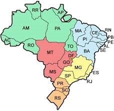

# Sem Título

**Data de Publicação:** 11/05/2016  
**Autor:** João de Brito Freires  
**Link Original:** [https://jbfreires.blogspot.com/2016/05/o-brasil-o-brasil-o-que-esperamos-deti.html](https://jbfreires.blogspot.com/2016/05/o-brasil-o-brasil-o-que-esperamos-deti.html)  

---

Ó! BRASIL

Ó! Brasil o que esperamos de
Ti. O que possamos fazer por Ti

Sois ostentados rico e
bondoso. Porém mergulharam - NO

Numa lama de corrupção

Até quando suportarás, A
nossa agressão?

Do descobrimento ao momento. És,
explorado, sugado e sufocado

Fingem - SE, estar tudo bem. Quando irás respirar?

O! Brasil com este coração
gigante. Suportam os bons e os ruins

Os que trabalham, e os que
não. Com teus braços fortes nos ostenta

Onde está a tua força, o teu
fôlego?

No
momento de muita tensão, muita responsabilidade, muita coragem

Quero,
(Queremos) Parabenizar as Autoridades; do STF. SUPREMO TRUBUNAL FEDERAL. PF. POLÍCIA
FEDERAL, MINISTÉRIO PÚBLICO, e demais AUTORIDADES ENVOLVIDAS NESTE PROCESSO. Este
trabalho ora iniciado é um dos melhores trabalhos prestado ao Brasil, aos
brasileiros. Se, não se recuarem e continuar com este belíssimo, bravo,
corajoso trabalho, temos a certeza que o Brasil, os brasileiros irão respirar e
não seremos mais explorados, sugados, sufocados. Os gananciosos saberão que não
mais terão espaço. Possamos
chamar o BRASIL de um novo nascimento, uma nova era?).

 As Leis, as Autoridades serão respeitadas. Os
gananciosos, sugas-sugas, não terão mais espaço para roubar. Parece até que há
uma competição entre os larápios da corrupção; QUEM ROUBA MAIS? Agora temos a certeza que não só irão ser
encerrados na prisão pagando assim pelos seus delitos, e mais, devolvendo assim
o fruto de sua desonestidade, com os devidos juros e correções. O homem
trabalhador irá encontrar o seu trabalho, honrando consigo mesmo, com sua
família, com sua Pátria. As Empresas hão de se fortalecerem. Os Partidos terão
mais responsabilidades nas escolhas de seus postulantes às cadeiras nos seus
diversos assentos. Os postulantes respeitarão mais os eleitores, as Leis, as
justiças as Autoridades. (Infelizmente o homem não respeita a Leis. Teme um
pouco as Autoridades), quando esta é séria, e estas têm nos surpreendidos. O Brasil,
tem demonstrado isto nos últimos anos.

Na
história do Brasil, nunca foram investigados, indiciados, processados,
julgados, condenados e presos, tantos homens escondidos por trás de suas
máscaras, (Hoje sendo desmascarados).
Com a mais pura certeza, todos os homens de bem deste País reconhece e quer
aplaudir de pé estas Autoridades. Os Senhores com este trabalho estão fazendo não
só o presente, mas sim o futuro, a paz, a prosperidade dos nossos filhos...
netos.... Estas corajosas Autoridades,
talvez não parou para pensar o bem que estão fazendo ao povo brasileiro. É
um trabalho marcante, a serem registrado nos anais da história do nosso povo,
orgulhosamente nosso Brasil. 

Rogo
a DEUS vida suficiente para ver este trabalho concluído. E que DEUS, ilumine e
dê força suficiente para que, estas autoridades não se fraquejem.

Com
isto, OS BRASILEIROS agradecem. O TRABALHADOR se aquecem. O Brasil se fortalecem.
O MUNDO reconhece. E a PAZ permanecem.

---