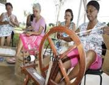

# Sem Título

**Data de Publicação:** 29/09/2015  
**Autor:** João de Brito Freires  
**Link Original:** [https://jbfreires.blogspot.com/2015/09/antigamente_58.html](https://jbfreires.blogspot.com/2015/09/antigamente_58.html)  

---

ANTIGAMENTE. 01

RETROSPECTIVA, DA
ÉPOCA, AO MOMENTO.

Antigamente,
as pessoas, (homens, e mulheres), plantavam, colhiam, fiavam, teciam,
construíam seus próprios vestuários.
Hoje compram prontas, nas medidas certas para se
vestir. 

Transportes, eram nos lombos
dos animais, carros de bois, carroças e carroções. Hoje
os mais diferentes modelos de navios, carros e aviões.

Iluminação, eram feitas
através de lamparinas abastecidas com
querosene, e candeias com óleo de mamona. Hoje
basta apertar uma tecla, um botão. 

O arroz, era pilado no monjolo ou no pilão. Hoje
já vem ensacado, pronto para ser cozido. 

O sabão, era feito pelas donas de casa com muito trabalho, usando
a cinza (diquada), como soda. Hoje basta
espremer o frasco. 

Calçados, era alpargatas, feitas de pneus e de barbantes,
cordão. Hoje calçados finos com a maior
sofisticação e ao alcance de todos. 

Comunicação, eram feitas através de mensageiros, cartas e
telégrafos. Hoje
Telefone, rádio, televisão,
Internet, etc. 

Doenças, eram curadas com o poder da fé, com benzedores, curandeiros e os raizeiros. Hoje hospitais e médicos especializados para cada parte do corpo e em número
razoável para atendimento. 

As grávidas, não faziam o pré-natal, tinha seus filhos com
as parteiras, com muito sucesso. Hoje fazem-se pré-natal e o parto em hospitais com
médicos especializados e enfermeiros (as). 

Ao quebrar, parte do
corpo, braços, pernas e outros, eram enfaixados pelos próprios familiares, usando
madeiras preparadas de bambu, quando curados aquele lugar às vezes ficavam
torto. Hoje se preciso, opera, engessa, voltando
ao normal e sem sequela.

Leite, não existia pasteurizado, era direto das tetas das
vacas ao consumo, conduzidos em latões, através dos carroceiros, vendidos
diretos nas residências. Hoje pasteurizado,
embalado, com grande quantidade de conservantes e vendidos em quase em todos os
estabelecimentos.

Lavoura, era desmatada,
plantada e cultivada manualmente. Hoje maquinário
para todos os tipos de trabalho. 

Animais selvagens, existiam
com abundância. Hoje em extinção.

Estudar, eram difícil, e as
pessoas não se preocupavam tanto. Hoje escolas
públicas e particulares, ao alcance de todos.

O Homem,
tinha as mãos calejadas, e sentiam honrados em trabalhar. Hoje trabalhar mesmo, quase ninguém quer.

---