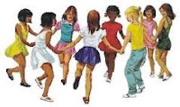

# Sem Título

**Data de Publicação:** 10/08/2015  
**Autor:** João de Brito Freires  
**Link Original:** [https://jbfreires.blogspot.com/2015/08/as-brincadeiras-de-antigamente_10.html](https://jbfreires.blogspot.com/2015/08/as-brincadeiras-de-antigamente_10.html)  

---

AS BRINCADEIRAS DE ANTIGAMENTE.

AS BRINCADEIRAS DAS CRIANÇAS. Brincava de; (Improvisava e inventava seus próprios
brinquedos). Bolas, pique-esconde, jogava finca, bola de gude, pião, pipa,
corrida dentro de saco, passar anel, estilingue, flecha, medir força, queda de
braço, roda, cabra-cega, cavalo de pau, saltar a distância, apostar corridas, Baliza,
Pular cordas, bilboquê, peteca, corrupios, subir em árvores, carrinhos, jogar
amarelinha, casinha, bonecas, ciranda-cirandinha, queimada, bate-rebate, bambolê
cozinhar, estátua, dança das cadeiras, bobinho, está quente-está frio, perna de
pau, pega vareta etc. (BRINCADEIRAS
PRAZEROSAS E INOCENTES).

Hoje quase tudo é eletrônico, “sem
querer querendo” nossas crianças estão sendo estimuladas, induzidas a usar
armas e a violência.

As
crianças de antigamente, tinham mais liberdades e eram mais seguras. Eram
admiradas, respeitadas e amadas pelos adultos. Andavam sozinhas pelas Ruas,
fazendas, passando pelas matas e campos, quando eram vistas por adultos, não
tinham nenhum receio. Os adultos com todo o respeito, os paravam, conversavam e
ofereciam ajudas, se estivessem perdidas, levava-os, até os seus lares e
familiares. Os tratavam com muito amor, eram um respeito total. 

Hoje
a falta de respeito e amor, é tanto que os maus feitores, muitos os assediam
para as drogas e atos sexuais. (Estuprando-as e muitas das vezes, matando-as
para dificultar as provas). É UM TERROR.
(A vida para muitos não tem nenhum valor).

Senhores, Pais, orientam, protejam mais os
inocentes dos seus filhos. É PRECISO FAZER NOVAS LEIS. Uma política não só de repreensão, mas de
educação e prevenção. Se o governo e
o ilustres governantes, criar uma nova política educativa e preventiva
direcionada as nossas crianças de hoje, e usar de suas lideranças não só para
cavalgar mais e mais as alturas, a competição, a vaidade, a fortuna, e olhar
para ao nosso amanhã, com certeza
tudo mudará, uma nova mentalidade surgirá, uma nova geração com maior
conscientização, com mais amor e respeito. 

(O malfeitor não é malfeitor porque quer
ser malfeitor). O NOSSO AMANHÃ, DEPENDERÁ DO NOSSO HOJE.

---