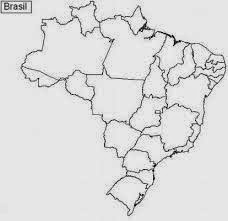

# Sem Título

**Data de Publicação:** 08/04/2015  
**Autor:** João de Brito Freires  
**Link Original:** [https://jbfreires.blogspot.com/2015/04/brasil-do-meu-sonho_18.html](https://jbfreires.blogspot.com/2015/04/brasil-do-meu-sonho_18.html)  

---

BRASIL DO MEU SONHO.

O BRASIL DO MEU, DO SEU SONHO.

QUANDO ...

Um Parlamentar, um Legislador
tiver um salário, um rendimento público compatível com o do professor.

O homem público ocupar um cargo por ideal e competência. 

O homem enxergar o Estado como um bem de todos e trabalhar pelo seu engrandecimento. 

Depois de eleito passar a
votar as matérias de interesse
do povo ou não, sem negociatas.

As Leis que
governa aos parlamentares, forem elaboradas e criadas por um corpo de cidadãos competentes, independentes,
e responsáveis, enquanto que as Leis que os regem, são ditadas pelos mesmos, a maioria, não fazem, não criam nada, se contrariarem os seus
próprios interesses. 

Os “cientistas” políticos se conscientizarem
e resolver dar uma dosagem certa de remédio para acabar de vez com a CORRUPÇÃO, este CÂNCER que destroem (vidas), economicamente
e moralmente o Brasil.

Os Partidos Políticos, tiverem os mesmos direitos na mídia, não importando se grande ou
pequeno
for, assim estarão
competindo de igual para igual, não permanecendo o poder nas mãos dos mesmos grupos.

Houver uma reforma política com a
elaboração e participação popular.

O candidato fazer sua campanha com seu próprio dinheiro, enfrentar o sol escaldante e furar a sola do sapato, invés de usar dinheiro das
empreiteiras e os rombos nos cofres públicos. (Sou a favor de fazer sua
campanha com seu próprio dinheiro
e prestígio). (Sob os olhares das autoridades competentes).

Os governantes pararem de dar esmolas
com o dinheiro público e dar
condições de trabalho ao homem, para sustentar sua própria família, não tirando
dele a oportunidade de crescimento.

Darem mais condição do homem no campo, (Aquele que produz o nosso alimento), para que viva e não ser preciso que, muitos
deles, tornar-se um favelado ou miserável na cidade.

Ao preso primário, for dado a ele um tratamento médico, psicológico, (orientação), oportunidade de pagar pelo delito cometido, com
trabalho social, com o propósito de recuperação,
desta forma evita o aumento de malfeitores, e inchaços desnecessários nas
cadeias.

Os condenados trabalhar para sustentar sua própria família, mais uma forma de pagar,
reconhecer e redimir do seu próprio erro.

O cidadão puder abrir a
porta de sua casa, e andar
tranquilo, levar suas crianças nas praças,
e andar tranquilamente.                

A criança puder sentir segura
junto ao adulto e não amedrontada,
ameaçada, abusada, estuprada.

Tiver Leis e um trabalho educativo
e preventivo, para coibir os maus feitores,
que vivem depredando o patrimônio público, particular e destruindo vidas. 

O cidadão puder acreditar cem
por cento nas autoridades.

As leis e o cumprimento, forem
iguais para todas as camadas sociais.

Houver uma conscientização que droga, é droga.

Quando o crime diminuir e o homem se conscientizar que a minha vida, é a sua vida.

O tratamento, médico e hospitalar, for realmente uma das maiores prioridades dos governos, com um pouco mais de respeito pela vida e sem burocracia.

A educação começar do berçário,
escolas, e chegar ao nível, educativo
e preventivo, em todos os níveis
escolares, para que os filhos dos
nossos filhos, sejam preparados e educandos,
para cuidar das crianças futuras, para
que não sejam malfeitores, e que
todos possam andar e viver em paz.

---