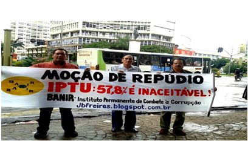

# Carta ao Povo

**Data de Publicação:** 07/12/2014  
**Autor:** João de Brito Freires  
**Link Original:** [https://jbfreires.blogspot.com/2014/12/carta-ao-povo.html](https://jbfreires.blogspot.com/2014/12/carta-ao-povo.html)  

---

A PROPOSTA DE AUMENTO DO IPTU,  

PROPOSTO PELO PREFEITO ATUAL DE GOIÂNIA.  

É UMA VERGONHA NACIONAL. 

A infração deste ano de 2014, foi aproximadamente, 7%.  

A Prefeitura de Goiânia, quer aumentar o IPTU, para, 57,8% 2015 + 29,7%. 2016. 
É REPUGNANTE.  

Este aumento É INACEITÁVEL! 

Não suportamos, aumento acima da infração. 

O aumento proposto e exigido pelo EXECUTIVO, ora em discussão e endossado por alguns aliados do LEGISLATIVO municipal de Goiânia é muito acima da infração. 

É um afronto: é imoral, arbitrário, abusivo, vergonhoso, desumano, desrespeitoso. É INACEITÁVEL MESMO. 

Vereador você que votar a favor. 

O MESMO GOIANIENSE QUE TE ELEGEU, NÃO IRÁ TE PERDOAR. 

Convidamos, as autoridades, associações, entidades classistas, empresários, proprietários, moradores, trabalhadores, “os inconformados”. ORDEIRAMENTE, mas, vamos nos defender? Vamos botar a boca no trombone. GOIANIENSES, TODOS NÓS SEREMOS  ETERNAMENTE PENALIZADOS. 

   

jbfreires.blogspot.com.br  “os mais variados pensamentos”.  

facebook.com BANIR-Instituto-Permanente-de-Combate a corrupção.

---