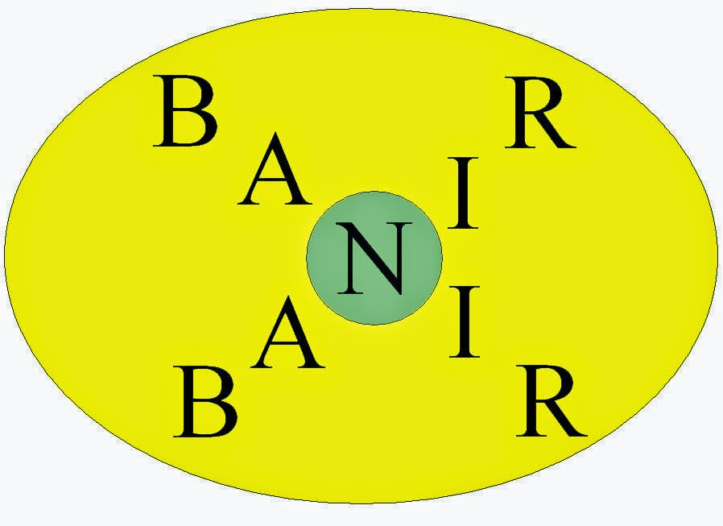

# Sem Título

**Data de Publicação:** 26/11/2014  
**Autor:** João de Brito Freires  
**Link Original:** [https://jbfreires.blogspot.com/2014/11/mocao-de-repudio-de-coautoria-deste.html](https://jbfreires.blogspot.com/2014/11/mocao-de-repudio-de-coautoria-deste.html)  

---

IPTU: 57,8% É INACEITÁVEL!

BANIR - Instituto Permanente de Combate à Corrupção, juntamente com o compositor João de Brito, autor do blog " os mais variados pensamentos" (http://jbfreires.blogspot.com.br/), vem a público oferecer Moção de repúdio contra o aumento de IPTU proposto pela Prefeitura Municipal de Goiânia.

(https://www.facebook.com/pages/BANIR-Instituto-Permanente-de-Combate-%C3%A0-Corrup%C3%A7%C3%A3o/252274654932524?ref=hl).

Onde está o povo? Onde estão os movimentos sociais?
Cidadãos goianienses, abram os olhos e se atentem contra esse abusivo e
desrespeitoso aumento do IPTU proposto pelo Executivo Municipal.

Não podemos permitir que uma proposta tão desproporcional
seja endossada pelos vereadores que nos representam. Se não agirmos, o que vai
acontecer? Não é justo que paguemos pela incapacidade administrativa do Paço
Municipal. Estão tirando o pão e o leite da mesa de nossas famílias.

Nada vale da criação, tampouco da majoração de tributos,
se o saco da ambição e da incompetência continua furado e sem fundo. Tudo que
se jogue ali dentro desaparecerá e será desperdiçado. O problema é de gestão e
não fiscal.

57,8% é inaceitável! Se o povo não descruzar os braços e agir, amanhecerá de
mãos atadas. Logo não poderá mais ser dono de nada e perderá o controle de
tudo. O BANIR (Instituto Permanente de Combate à Corrupção) repudia essa
pretensão da administração municipal.

Num movimento respeitoso, pacífico e ordeiro, temos o
dever de nos defender. Precisamos sair à rua para manifestar toda a
insatisfação e indignação que nos assola, ante a iminência da arbitrariedade pretendida.

Vamos à luta!

Goiânia, 25 de novembro de 2014.

---