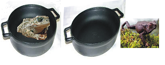

# O Sapo

**Data de Publicação:** 06/11/2014  
**Autor:** João de Brito Freires  
**Link Original:** [https://jbfreires.blogspot.com/2014/11/o-sapo.html](https://jbfreires.blogspot.com/2014/11/o-sapo.html)  

---

Li uma matéria publicada pelo grande
escritor, Paulo Coelho, tendo como Título
“O sapo e a agua quente”. Gostei, criei estória em cima da estória, com algumas
ilustrações a mais, e publico neste blog.

Esta matéria informa que se você pegar
um sapo e colocar em um recipiente com a mesma agua em que ele vive e colocar a
ferver, o sapo continua na fervura até se estorricar e morrer, mas não abandona
aquele lugar. (Preguiça e obediência demais é assim).

Porém, se você pegar outro sapo,
colocar num recipiente com a agua diferente do ambiente que ele habita, e começar
a ferver, imediatamente ele salta daquele recipiente, saindo mesmo chamuscado,
mas não espera sua ruina, e sai pulando a procura de outro habitar.

ESSA
ESTÓRIA REFERE-SE AOS ACOMODADOS E AOS NÃO ACOMODADOS.

O
primeiro refere-se ao homem que se
acomoda tanto, se estagna no tempo. Se tens emprego, ele trabalha, se não tem,
tanto faz, tanto fez. Se tens o que comer e vestir, tudo bem, se não tem, não
vai à luta e fica sempre de boca aberta, esperando que alguém faça algo por
ele, porém não se mexe para nenhum dos lados. Sua família, ela é que se vira. É
um preguiçoso mesmo, sem perspectiva de vida, sem razão. Mesmo se arruinando,
se estorricando, ele não se mexe.

O
segundo é aquele que não se acomoda e
sabe dar os seus pulos, mesmo nas melhores situações, ele sabe que tem um
espaço maior e que pode ser conquistado. Leva uma vida mais ativa e prolongada,
com qualidades melhores. Para continuar vivo, tem que dá os seus pulos, não deve
se acomodar. Salta da panela antes que a água ferva. 

Vou citar um verso de uma poesia, que
aprendi a sessenta e três anos, quando aluno da primeira Escola dirigida pela
Professora por nome de AMASÍLIA,
(dona beleza), quando participamos de um desfile numa competição entre as
Escolas, na cidade de Rubiataba - GO.

NA
CASA DOS PREGUIÇOSOS

HÁ
SEMPRE FALTA DE PÃO,

TODOS
RALHAM, TODOS GRITAM

PORÉM,
NINGUÉM TEM RAZÃO.

---