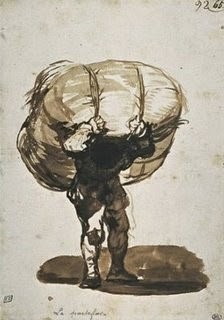

# DETALHES DA VIDA

**Data de Publicação:** 04/10/2014  
**Autor:** João de Brito Freires  
**Link Original:** [https://jbfreires.blogspot.com/2014/10/detalhes-da-vida.html](https://jbfreires.blogspot.com/2014/10/detalhes-da-vida.html)  

---

Quando um casal de jovens se casam, constitui família.
Os filhos crescem, a casa se enche. Os filhos casam, vão embora. Os velhos
ficam a sós. O amor continua a dois, mesmo assim colocam os filhos e netos em
primeiro plano. Nas discussões normais o esposo sempre adverte a esposa, que os
filhos já têm suas vidas próprias, sua família, não mais precisam se preocupar,
a vida hoje é, primeiramente, o nosso DEUS,
segundo, eu pra você e você para mim, e assim a bola continua rolando, até
quando ELE permitir a vida a dois.
Não tem outra alternativa. A esposa como mãe querem levar aos filhos, os
acontecimentos, o esposo sempre repreendendo, não faça isto, não os incomodam,
vamos resolver nossos próprios problemas. Com a idade, todos ficam mais
susceptível as doenças. O esposo além de outras complicações, também já um homem
hipertenso, um dia a pressão arterial se descontrolou a ponto de serem atendido
por vários médicos e pronto socorros especializados, e a pressão continuava
descontrolada. A esposa que tinha um coração sadio, não sabia o que era este
tipo de doença, a preocupação era tanto que a pressão do seu coração começou a
descontrolar, chegando ao ponto de ser socorrida algumas vezes em prontos
socorros de hospitais.

A pressão do coração do esposo. A alta e a baixa subiam,
(Pressão arterial sistólica). A da esposa a alta
e a baixa, baixavam, (Pressão arterial diastólica). Então
o esposo mesmo naquela situação, para descontrair a esposa, em termo de
brincadeira, disse, aí está, quando a gente se casa, não torna-se um só?

Então se juntar a diferença da pressão do seu coração
com o meu, fundir os nossos dois corações em um só, vai dar um coração sadio, não é assim que dizem a palavra do SENHOR. Quando se casa, torna-se um só
corpo? 

Quanto mais tempo durar a vida a dois, mesmo com todas
as tribulações, percebe-se que o amor ainda é maior e verdadeiro, com muito respeito
e sem egoísmo. Por isso quando um adoece, o outro sente profundamente, chegando
ao ponto de ficar também doente. Através
da dor, do sofrimento, fluem-se ainda mais o amor.

---