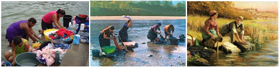

# Lavadeiras

**Data de Publicação:** 17/09/2014  
**Autor:** João de Brito Freires  
**Link Original:** [https://jbfreires.blogspot.com/2014/09/lavadeiras.html](https://jbfreires.blogspot.com/2014/09/lavadeiras.html)  

---

HÁ UM COSTUME, UMA TRADIÇÃO ANTIGA DA
BOA VIZINHANÇA. 

Este
texto ilustrativo é só para mostrar, o ditado popular, de quem fala muito e
desordenadamente.

Certa
vez numa cidade do interior, reuniram-se as comadres, amigas, para lavar roupa
num córrego bem próximo, é quase uma prática, um costume, uma tradição antiga.Geralmente
as lavadeiras, fazem das pedras as tábuas de baterem roupas. Além de ser um
trabalho prazeroso, é um momento de muitas cantorias e desconcentração. Num
determinado momento de euforia, por um pequeno descuido,uma
daslavadeirasdeixou a bola de sabão escorregar de suas mãos.Foi um momento
crítico. Imediatamente, ela entrou em desespero, e começou a gritar e percorrer
com suas mãos no leito do rio. Nossa comadre
escapuliu das minhas mãos.Ajuda-me comadre.Socorro. Só tenho esta
bola. Como que faço comadre. A comadre, Minha nossa, como foi. Escorregou,estava muito liso. E
a gora.Segurei firme, más não adiantou.Pulei em cima, molhei toda, até minha calcinha foi
junto.Vou pra casa com menos roupa. Como vou embora comadre, com a roupa suja e sem a calcinha.Quando o povo souber, que vergonha.É a primeira vez comadre.Sim
é a primeira. A correnteza aqui tá muito forte. A próxima vez não vou deixar escapar das minhas mãos. Só se eu for junto, vou segurar com mais garra. Não se desespere comadre, eu trouxe duas bolas, vou
emprestar uma pra você. Deixando assim a comadre mais calma. Assim vai poder terminar de lavar a sua roupa.Mas, e a calcinha. A calcinha é impossível.Ele levou.

Quando
alguém Fala muito, costuma dizer, que este alguém fala mais que lavadeira
quando perde o sabão na correnteza de um córrego.

---