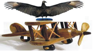

# Os carniceiros

**Data de Publicação:** 16/06/2014  
**Autor:** João de Brito Freires  
**Link Original:** [https://jbfreires.blogspot.com/2014/06/os-carniceiros.html](https://jbfreires.blogspot.com/2014/06/os-carniceiros.html)  

---

Carniceiros! Carniceiros! 

Quando a oferta é muita, não sabem o que comer
primeiro. 

Se pudessem comeriam tudo e todos. 

O que querem e encher bem o seu papo. 

Sua fome é tamanha que se deixar comem a maior
parte da carne ainda viva. 

São astuciosos tendo o olfato e a visão bem apurados
para chegar primeiro. 

Ao escolher e conquistar o prato, a disputa é
ferrenha com seus comparsas pelos melhores lugares. 

Não se lembram mais dos que já se alimentaram
no passado. O que importam é continuar alimentados por mais alguns tempos.

Quando cheio, há! Aí é uma delícia.

Trocam de plumagens, querem vôos mais altos,
ficam mais robustos. 

Com seu papo
cheio e forte, querem comer muito mais. 

Fazem de tudo para não perder a sua pose. E assim continuar nas alturas.

Oh! Egoístas Carniceiros.

Porque
tanto egoísmo?
Não sabeis vós que quando recebermos a convocação Lá do Alto, não levaremos
nada disso. O que levaremos é tudo aquilo que de bom ou ruim praticamos.

---