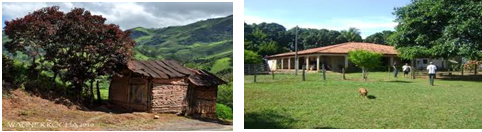

# Casinha

**Data de Publicação:** 21/05/2014  
**Autor:** João de Brito Freires  
**Link Original:** [https://jbfreires.blogspot.com/2014/05/casinha.html](https://jbfreires.blogspot.com/2014/05/casinha.html)  

---

Ao
ler um jornal da Capital Goiana, deparei-me com uma matéria, do escritor Paulo Coelho, “O pequeno sítio e a
vaca”. Gostei tanto que reproduzo ela aqui no meu blog, alem de tecer alguns
comentários que julgo relevantes.

A HISTÓRIA. 

“Um
filósofo e um Discípulo estavam andando pela floresta, em um lugar bem distante
de tudo e de todos, de repente, depararam com uma casinha muito humilde, pobre
mesmo, era feita de pau a pique sem reboco. Inicialmente acreditaram que era
uma casa abandonada. Resolveram então aproximar-se um pouco mais e ao bater
palmas, saíram a porta um casal com três filhos, com vestes rasgadas, sujas, maltrapilhos
mesmo. O filósofo observou que não havia nenhum conforto necessário aquela
casa.  À noite, a iluminação que existia
era o clarão da lua. E o sistema de iluminação que existiam na época e no local,
ainda rústico, as famosas lamparinas e candeias. O azeite eram extraídos por eles
mesmos da semente da mamona, que colocado nas lamparinas e candeias, serviam
para alumiar o ambiente ao seu redor. A água era buscada em um pequeno córrego,
mais próximo. Depois destas observações o Filósofo indagou: Como vivem num
lugar deste, tão distante da cidade, sem os principais recursos. O Senhor então
respondeu: Nós temos aqui uma vaquinha,
onde tiramos o leite, nos alimentamos, fazemos queijo, manteiga e o que sobra,
apesar da distância, nós vamos até a cidade e trocamos por outros gêneros
alimentícios. O filósofo e seu Discípulo, agradeceu e contemplou aquele lugar por
uns momentos, e continuando no seu trajeto, depois de percorrer uma pequena
distância, por um instante parou e disse ao seu Discípulo, volta, pega aquela vaquinha e joga naquele precipício, o
Discípulo ficou assustado mas cumpriu com a determinação. O Discípulo, com o
passar do tempo, tornou-se um grande empresário e aquele ato praticado nunca
saiu de sua mente. Depois de muitos anos, resolveu voltar aquele lugar, com a
intensão de contar a eles a história e ajudar aqueles pobres coitados
financeiramente, o qual julgava que tinha desgraçados suas vidas ainda mais,
matando sua única fonte de alimentação. Chegando aquele lugar, assustou-se ao encontrar
ali uma casa linda, com carro na garagem, com jardim em todo ao seu redor, e
crianças correndo e brincando no pomar, ao ser atendido, perguntou por aquelas
pessoas que moravam ali há alguns anos, a resposta que obteve, que eram as
mesmas. Ao entrar a casa, veio ao seu encontro aquele Senhor, que havia os
recebidos há dez anos, que imediatamente o reconheceu, e perguntou como está o
Filósofo. Indagado como conseguiu toda aquela fortuna. Ele disse. Nós tínhamos
uma vaquinha que tirávamos o leite,
e dela fazíamos o nosso sustento, mas um dia ela caiu num precipício. Ficamos
desesperados, na tentativa de buscar nova alternativa, começamos a cultivar a
terra, plantar ervas e legumes, cortar madeira e comercializar. O primeiro ano
foi muito difícil. Com o crescimento dos negócios, fomos a cidade comprar
roupas para os nossos filhos, ao observar o material das roupas, começamos a
plantar algodão e ervas aromáticas, mas daí em diante, foi só sucesso, passamos
exportar todos os nossos produtos. Se
aquela vaquinha não tivesse morrido. Não dariam conta do potencial daquela
terra”.

O meu Pai mesmo naquele tempo já dizia; Quando as coisas estão muito ruim, mas muito ruim, quando nossa vaquinha cai no precipício,
achamos que não tem mais jeito. Está para
melhorar. É nesse momento que devemos parar, pensar, nos encorajar e buscar
as soluções. Com certeza encontraremos. Assim como fez aquela pobre família. Ai está o segredo do sucesso.

---