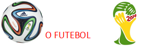

# COPA DO MUNDO NO BRASIL.

**Data de Publicação:** 22/04/2014  
**Autor:** João de Brito Freires  
**Link Original:** [https://jbfreires.blogspot.com/2014/04/copa-do-mundo-no-brasil.html](https://jbfreires.blogspot.com/2014/04/copa-do-mundo-no-brasil.html)  

---

O
futebol é o esporte que alcança a maior índice de audiência no mundo. O Brasil
vibra, o mundo se alegra, a bola rola e A
TAÇA TEM TUDO PRA SER NOSSA. Como faço parte deste índice, acho que é um
privilégio este acontecimento ser realizado em nosso País, é um prestígio a
todos nós Brasileiros. 

Vamos
Brasil, torcer, vamos fazer a nossa parte, para que a copa seja realizada na
mais pura harmonia, pois ela é de todos nós. Que sejamos mais uma vez, campeões.

 Agora, se, temos dinheiro suficiente para
realizar o maior espetáculo da terra, a (Copa do Mundo). É lógico que,
naturalmente não faltam recursos financeiros para cuidar da saúde deste povo
sofredor. Cuidar daqueles que há muito esperam por um simples tratamento, uma cirurgia,
de um atendimento digno. Estes certamente irão torcer, participar e fazer parte
deste grande espetáculo.  O espetáculo só existe porque existe o espectador.

A Senhora
PRESIDENTA, foi uma sofredora e parece
que tem bom coração. Às autoridade constituídas que comandam esta Nação, tenham
compaixão.

Vejam a matéria POSTADA NESTE BLOG, no dia 06 de novembro de 2013.

Por este e outros motivos é que repetimos este apelo.

Autor: João de Brito, Abril de 2014.

---