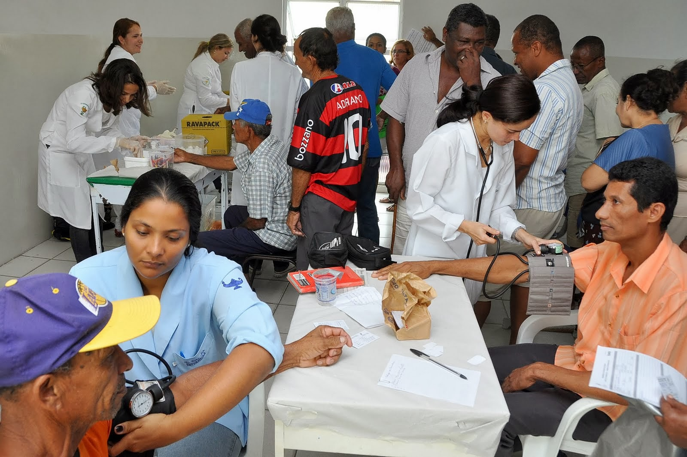

# MUTIRÃO NACIONAL DA SAÚDE

**Data de Publicação:** 17/04/2014  
**Autor:** João de Brito Freires  
**Link Original:** [https://jbfreires.blogspot.com/2013/11/mutirao-nacional-da-saude.html](https://jbfreires.blogspot.com/2013/11/mutirao-nacional-da-saude.html)  

---

MUTIRÃO NACIONAL DA SAÚDE.

O alívio, a salvação.

Há uma calamidade na saúde pública. Doentes em situações
graves aguardando tratamentos, outros simplesmente aguardando por uma consulta,
outros com partes do corpo quebradas necessitando urgentemente de cirurgia, esperando
na fila de espera por dias, meses e até anos e não conseguindo. Com isso seu
estado de saúde agrava-se ainda mais, muitas vezes vindo a óbito. 

A Presidenta Dilma num
propósito nobre importou médicos na tentativa de amenizar um pouco o sofrimento de muitos, porém acreditamos
que ainda não é a solução devido ao grande número de pessoas doentes nas filas
aguardando por atendimento.

Sugerimos a Presidenta
e as demais autoridades constituídas que num ato humano e solidário paralisem partes
de outros trabalhos, por um período mínimo necessário, utilizando estes
recursos em cima de um grande MUTIRÃO DA
SAUDE, envolvendo todos os profissionais médicos, públicos e particulares,
hospitais, etc. em todos os atendimentos e tratamentos cirúrgicos.

Sugerimos ainda mais, se não for possível, fazer este MUTIRÃO DA SAÚDE de imediato, que os Senhores Deputados e Senadores que, ao aprovarem
o orçamento da saúde para 2014, façam dentro de um planejamento financeiro que
abarque os recursos necessários para realizar este mutirão. Se mesmo assim os
recursos financeiros destinados a SAÚDE,
não forem suficientes, retirem parte dos orçamentos de todos os outros
Ministérios para salvar estas vidas e amenizar tantos sofrimentos. 

Com a habilidade que o caso requer, acredito, que todos os Estados e as demais autoridades Governamentais iriam se
empenhar, e abraçar esta causa.

Com este gesto, acredito no envolvimento voluntário da população, de alguma forma.

A recompensa vem de DEUS.
O povo e a Vida agradecem.

Autor: João
de Brito Freires, 05/11/2013.
Republicano neste Blog em 17/04/2014.

---