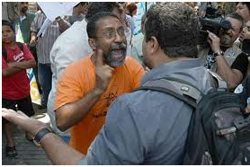

# REAÇÃO A UMA AGRESSÃO.

**Data de Publicação:** 09/04/2014  
**Autor:** João de Brito Freires  
**Link Original:** [https://jbfreires.blogspot.com/2014/04/reacao-uma-agressao.html](https://jbfreires.blogspot.com/2014/04/reacao-uma-agressao.html)  

---

Seja sensato. Não revide uma agressão, porque aquele
que o agride, pode estar, por um instante, tomado por uma força negativa, e
este instante é muito perigoso. Portanto seja sensato, pense duas vezes,
respeita-o e viva.

---