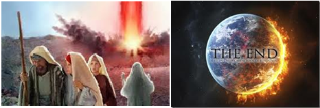

# Tudo é realmente natural?

**Data de Publicação:** 12/03/2014  
**Autor:** João de Brito Freires  
**Link Original:** [https://jbfreires.blogspot.com/2014/03/tudo-e-realmente-natural.html](https://jbfreires.blogspot.com/2014/03/tudo-e-realmente-natural.html)  

---

A GUERRA DO MOMENTO. Jovens matando, roubando, prostituindo-se, destruindo e sendo destruídos,
morrendo com as drogas e pelas drogas. Tudo
aparentemente muito natural. Novelas em horários nobres incentivam a
prostituição, os programas televisivos valorizando mais a nudez, o culto ao
corpo do que a pessoa. Tudo aparentemente
muito natural. A prostituição infantil, o desrespeito as nossas crianças. Tudo aparentemente muito natural. As autoridades
da Lei aprovando e regulamentando as drogas, o homem - sexualismo. Tudo aparentemente muito natural. Estamos
caminhando novamente a Sodoma e Gomorra? E
AÍ, TUDO É MESMO NATURAL?

POR QUE TUDO O QUE NÃO É NATURAL ESTÁ PARECENDO SER? Falta amor, respeito, responsabilidade,
compromisso, ocupação e falta principalmente buscar a DEUS. As notícias que se espalham pelo mundo em questão de segundos,
sem nenhum controle respeitoso, o incentivo pela mídia pra sair do armário, mesmo
em tom de humor, (considerando que todo
homem e mulher estão dentro do armário) às vezes a pessoa ainda nem entrou,
mas com a porta aberta, o incentivo, o inimigo
atenta e a pessoa entra,“pra depois sair”.

As igrejas, religiões, os religiosos
protestam, mas o inimigo também é poderoso
agindo sobre os incrédulos. Como não é a maioria que protestam, o
crescimento do aparentemente
natural vai aumentando.

VAMOS FAZER A NOSSA PARTE!!! Os pais, os educadores, as autoridades as pessoas de bem,
devem orientar as nossas crianças, nossas famílias, ensinando o certo e o
errado para que não aceitem as coisas erradas como naturais, não embarquem
nesta onda. Acredito muito no amor, no bom diálogo dentro dos ensinamentos de DEUS. Vamos fazer nossa parte.

Há um conto ilustrativo que diz.(acredito que você, caro leitor já
ouviu). 

“Certa vez houve um grande incêndio na floresta. As chamas se elevavam a
uma enorme altura e as árvores começavam a ser pouco a pouco destruídas pelo
fogo.

Os animais, apavorados, corriam em busca de abrigo, fugindo
desesperadamente da catástrofe. Enquanto isso, um pequenino pássaro voava
velozmente até o rio, pegava no minúsculo bico uma gota de água e trazia-a até
a borda da floresta, deixando-a cair sobre as chamas.

Observando o vai-e-vem da ave, uma coruja velha e ranzinza que ia
passando por ali interrogou-o:

- O que você está fazendo?

- Não está vendo? Estou trazendo água do rio para apagar o incêndio antes
que ele destrua toda a floresta – respondeu a avezinha.

- Você deve ser maluco – disse a coruja. – Não está vendo que é
impossível apagar esse incêndio enorme com essa gotinha de água?

- Sei disso – o pássaro falou. – Estou apenas fazendo a minha parte”.

 SE CADA UM DE NÓS FIZER A SUA PARTE.
O APARENTEMENTE NATURAL DEIXARIA DE EXISTIR.

---