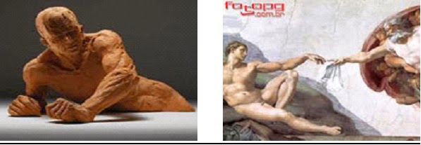

# A Divergência

**Data de Publicação:** 28/02/2014  
**Autor:** João de Brito Freires  
**Link Original:** [https://jbfreires.blogspot.com/2014/02/a-divergencia.html](https://jbfreires.blogspot.com/2014/02/a-divergencia.html)  

---

A princípio existia o homem só em espírito, nas
alturas do Céu. Então DEUS, do barro
fez a forma, colocando o espírito. Para que aqui na terra o homem vivesse em
forma semelhante com a superior. Infelizmente o homem foi tentado, daí a forma
mais divergente, mais diferente da superior. Diferença, maldade, preguiça,
guerra, sofrimento, fome. Então a separação espiritual da corporal. Daí a
esperança do homem voltar ao plano superior.

---