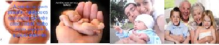

# A vida

**Data de Publicação:** 19/02/2014  
**Autor:** João de Brito Freires  
**Link Original:** [https://jbfreires.blogspot.com/2014/02/a-vida.html](https://jbfreires.blogspot.com/2014/02/a-vida.html)  

---

A VIDA, TUDO É MISTÉRIO. O
que mais me impressiona é o milagre da reprodução. É a luta do espermatozóide, pelo
seu espaço, pela vida. E aí que percebemos que a luta pela vida é constante e
prazerosa, mas só quem luta e acredita nela alcança a vitória. 

Os filhos, a maior
esperança do casal. Na expectativa que o CRIADOR
consinta aos seus a tão sonhada
sementinha. O maior presente, um filho para os seus filhos. Porque a obra é de DEUS. Os filhos antes mesmo de serem
nossos filhos, são nossos irmãos. Pois DEUS,
o Criador, o seu PAI é o mesmo nosso PAI.

Eis a nossa maior responsabilidade
ao sermos pais. O milagre da criação
é exclusivamente de DEUS. Já a responsabilidade
à vida é nossa.

Nasce o bebê,
sendo admirado e cuidado em especial pelos principais responsáveis, os seus pais, amparados pela família. O bebê cresce,
chega à idade adulta, casa e constitui uma nova família, com o mesmo
consentimento. 

Os pais têm
que conviver com este dilema. Se trabalham muito quando jovens para dar o
melhor para seus filhos, acabam perdendo o convívio do dia a dia, logo não
conseguem acompanhar seus filhos o quanto queriam,  desejavam, o quanto precisavam, perdendo
muitas vezes o seu crescimento, as suas peraltices. 

Quando avós,
muitos já aposentados, com tempo disponível e suficiente, necessitam dar e
receber carinho. Nesta fase, cuidar dos netos não é nenhum dever, é uma terapia,
uma alegria. Eis o papel principal dos avôs e avós, preencher os espaço, as
lacunas da vida com amor e carinho divididos mútuamente com seus netos. É por
este e outros motivos, todo este apego. Não sei se por ciúme ou competição, esta
proteção dos avós acaba sendo considerado pelos pais das crianças, um exagero. 

Netos, os filhos
açucarados, filhos especiais. E assim é dado o prosseguimento, a continuidade a
vida. ( A minha filha um dia me disse, Papai quando era eu o senhor não fazia
assim, eu respondi em termos de brincadeira, você é filha, eles são netos). 

Somos responsáveis por
esta corrente contínua, esta bola rolando, o prosseguimento da vida. O que
importa muito para o nosso futuro é a formação de berço.

Dizem que o bebê é
como a memória de um computador, com muitos bytes, sendo preenchidos aos
poucos, pelos Pais e educadores, com bons ensinamentos, uma boa criação, o
amor, o carinho. O Comportamento dos
bebês reside nas atitudes dos pais.

A harmonia, o amor, o respeito
entre os pais, isto é especial para que o bebê tenha uma boa vida, uma boa
formação.

As crianças mesmo
antes de falar e andar já percebem tudo ao seu redor. Crianças capitam e
guardam as coisas em sua memória com grande facilidade. Portanto, não discutam,
não esbravejem, não faça algo perto de uma criança, pensando que ela não está percebendo.
Não falam algo que possam prejudicar.

A minha formação depende de você papai
você mamãe. O NOSSO AMANHÃ É O RETRATO DO NOSSO HOJE.

Autor: De João de Brito Freires em homenagem ao meu neto Mateus nascido em 14/02/2014.

---