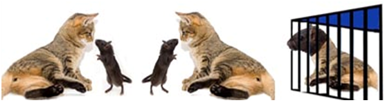

# Caça aos Gatos-Ratos

**Data de Publicação:** 06/01/2014  
**Autor:** João de Brito Freires  
**Link Original:** [https://jbfreires.blogspot.com/2014/01/caca-aos-gatos-ratos.html](https://jbfreires.blogspot.com/2014/01/caca-aos-gatos-ratos.html)  

---

O gato que caça o rato;

Que caça o queijo o seu principal desejo.

Gatos-Ratos, quanto mais comem, mais querem;

Com suas astúcias permanecem na mansidão.

Com tantos queijos tornaram ainda mais poderosos;

Traquinas ambiciosos, gorda obsessão.

Porém os caçadores começaram a perseguição;

Num caça aqui, caça acolá, até que certo dia caíram na ratoeira da
prisão. 

Ainda com o queijo em suas mãos;

Começam a ratear pra comer fora da prisão.

É assim minha gente, todo GATO-RATO
se acha um espertalhão; 

O que importa pra ELES é o queijo em suas mãos.

Todos já são poderosos e preparados;

Sabedores do que poderia acontecer, ou não.

Mas permaneciam no escuro; 

Confiantes de que seu porte era a sua proteção.

Pra que tanta ambição?

 Acreditem, AS CORDAS DAS VIOLAS ESTÃO EM AFINAÇÃO.

A dança não é boa e ainda não acabou. 

E os GATOS-RATOS também não.

Autor: João de Brito
Freires, Janeiro de 2014.

---