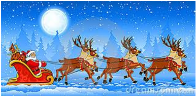

# Mensagem de Natal

**Data de Publicação:** 16/12/2013  
**Autor:** João de Brito Freires  
**Link Original:** [https://jbfreires.blogspot.com/2013/12/mensagem-de-natal.html](https://jbfreires.blogspot.com/2013/12/mensagem-de-natal.html)  

---

Natal. Data Universal. Data em que
comemoram em todo Mundo, o nascimento do Filho
do Homem, Criador do Universo. Nosso Senhor
Jesus Cristo.

Os povos festejam conforme seus
costumes regionais e suas crenças religiosas, com toda reverência e respeito ao
nascimento do Filho do Homem, o Construtor de todos e de tudo.

Uns comemoram com muitas festas,
bebidas, comidas, brincadeiras e muita alegria com seus familiares, amigos e
irmãos.

Outros, com muito respeito, oração,
reverências, admiração e gratidão pelo nascimento do Filho do Criador que
veio, sofreu e deu a vida para a nossa salvação.

De alguma forma, todos procuram
esta recordação. Em nome do homem de barba branca, nós continuamos presenteando
nossas crianças, anjinhos inocentes, que acreditam no Papai Noel, o homem de
cabelos e barbas brancas, que vem especialmente nesta data para alegrar a estes
que os aguardam ansiosamente.

No Velho Testamento, (Antes) DEUS falava com os seus escolhidos e
estes transmitiam suas Leis e ensinamentos ao seu povo.

Com a vinda de seu Filho de Deus à terra, redimindo-nos
dos nossos pecados, passamos a falar diretamente com DEUS, através de seu FILHO,
em nossos pensamentos e orações.

Hoje, ao invés de comemorarmos
unicamente o nascimento do FILHO DE DEUS,
lembramo-nos mais do homem de cabelos e barbas branco, tão anunciado pela mídia.

Alertemo-nos para não transformarmos
esta data milenar tão importante, histórica e significativa em consumismo
frívolo e festanças desordenadas. Os hábitos e costumes comerciais estão direcionados
mais no homem de barba branca que estimula o lucro do que no verdadeiro sentido
do natal que é a comemoração da vinda, do NASCIMENTO DO NOSSO SENHOR JESUS
CRISTO.

Autor: João de Brito Freires, 16/12/2013.

Feliz Natal!!!!!

---