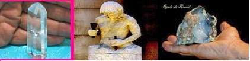

# SOFREMOS É PORQUE QUEREMOS?

**Data de Publicação:** 28/11/2013  
**Autor:** João de Brito Freires  
**Link Original:** [https://jbfreires.blogspot.com/2013/11/sofremos-e-porque-queremos.html](https://jbfreires.blogspot.com/2013/11/sofremos-e-porque-queremos.html)  

---

Quando nascemos, somos uma Pedra polida,
lapidada, um diamante com o mais alto índice de polimento, revestidos pelas
mãos do nosso CRIADOR. Somos
inocentes, não temos maldades, somos meigos, carinhosos, amorosos, os mais puros
dos puros. Com o passar dos tempos, automaticamente, com os conhecimentos profanos e mundanos, este diamante vai se revestindo, se transformando
numa pedra bruta. Aí a necessidade de voltarmos a ser uma Pedra polida. 

Como acontecem tais transformações?  

Numa lei natural da vida, começamos
com um trabalho às vezes consciente às vezes inconsciente no nosso cotidiano. Nossos
pais, educadores e autoridades trabalham incansavelmente para o nosso
polimento. Na medida em que vamos crescendo, vão também aumentando nossos
deveres, nossas responsabilidades, nossas obrigações. Inicialmente somos conduzidos
as Escolas pelos nossos pais ou responsáveis, o que nos dá segurança e muito
orgulho, lugar onde passamos e aprendemos a conviver com nossos coleguinhas e
professores. Recebemos ali nossos primeiros conhecimentos literários. Depois passamos
a ir à escola sem o acompanhamento dos nossos pais ou responsáveis. Isto para
nós já é um grande avanço, pois este momento é tudo o que mais esperávamos. É Isto
que chamamos de liberdade. Logo vem a faculdade, o trabalho, nosso consciente vai
se enchendo de sabedoria e conhecimento cada dia mais. As Leis do homem, a Lei DIVINA, vão transformando-nos. Naturalmente
os que optam por respeitar as Leis, automaticamente se direcionam para o bem.
 Autor: João de Brito Freires, 2013. (1ª parte)

---