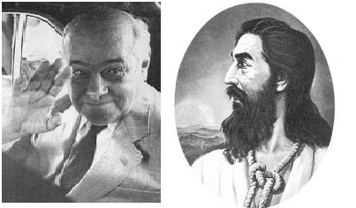

# Tancredo Tiradentes.

**Data de Publicação:** 12/11/2013  
**Autor:** João de Brito Freires  
**Link Original:** [https://jbfreires.blogspot.com/2013/11/tancredo-tiradentes.html](https://jbfreires.blogspot.com/2013/11/tancredo-tiradentes.html)  

---

Há
193 anos, justamente no dia 21 de abril de 1792, morreu Joaquim José da Silva
Xavier, o Tiradentes. Hoje, 21 de abril do ano de 1985, morre Tancredo Neves. O nosso Tiradentes
voltou e se foi de forma mais gratificante e diferente. Tiradentes decepado,
esquartejado, cruelmente assassinado. Presidente, assistido, operado, admirado, amado, mas que a
doença tomou conta insistentemente. Presidente de forma mais avançada,
advogado, veio pra fazer justiça e defender sua gente. Ambos nasceram e viveram na mesma região, nas mesmas terras, com os mesmos propósitos. Tanto o
Presidente quanto Tiradentes não viram, com seus olhos, o bem que fizeram
a sua gente. Tiradentes? Presidente? Ou
Tiradentes Presidente. Tancredo só não teve o seu gabinete odontológico.
Presidente com sua forma mais ardente veio para mudar mais de vinte anos de
opressão para o regime de libertação. Regime onde poucos muitos falavam para
regime onde com liberdade muitos falam. 

Matéria escrita no dia 22/04/1985,
justamente um dia após a morte do Presidente. 

Autor: João de Brito Freires

---